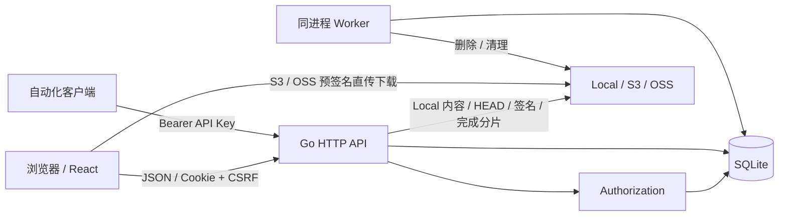

# 技术架构

本页描述当前仓库实现；接口字段见 [OpenAPI](openapi.yaml)，默认值和生效边界见[配置参考](configuration.md)。

## 组件与源码

| 组件 | 职责 | 主要源码 |
| --- | --- | --- |
| React 19 / Ant Design 6 | 项目文件管理、公开分享、后台管理 | `frontend/src/pages/` |
| React Router / TanStack Query | 路由懒加载、服务端状态缓存 | `frontend/src/routes/router.tsx`、`frontend/src/main.tsx` |
| API 客户端 / 上传管理器 | Cookie/CSRF、错误包装、直传与进度 | `frontend/src/api/client.ts`、`frontend/src/upload/UploadManager.tsx` |
| Go / chi HTTP API | 路由、认证、校验、响应序列化 | `backend/internal/httpapi/` |
| Authorization | 用户与项目的实时读写权限 | `backend/internal/authorization/` |
| Repository / SQLite | 元数据、事务、持久化限流 | `backend/internal/repository/` |
| Storage adapter | Local、S3、OSS 的统一对象操作 | `backend/internal/storage/` |
| Worker | 对象删除、过期上传与 OIDC 流程清理 | `backend/internal/worker/worker.go` |
| CLI / migrations | 初始化、启动、管理员密码恢复、升级 | `backend/cmd/altasci-server/main.go`、`backend/migrations/` |

前端静态产物和后端分别部署。Go 不嵌入前端，也不提供 SPA 路由。SQLite 保存身份、权限、目录、文件名、分享和配置；存储后端保存对象内容。数据库内 Object Key 为 `v1/objects/{project_id}/{blob_id}`；S3/OSS 适配器会再加配置的 prefix；Local 实际路径为 `<root_path>/objects/{project_id}/{blob_id}`。存储连接测试另使用 `.altasci-health/` 临时键。

## 数据模型

| 表 | 用途与约束 |
| --- | --- |
| `users`、`sessions` | 唯一规范化邮箱；最多一个 active admin；会话只保存 token/CSRF 摘要 |
| `api_keys` | API 密钥摘要、前缀、Scopes、项目范围、有效期、撤销和最近使用时间 |
| `projects`、`project_members` | 项目固定关联存储后端；成员权限为 read/write |
| `fs_nodes` | 父子目录关系；`parent_id IS NULL` 为项目根；未删除同级规范化名称唯一 |
| `file_blobs` | 物理对象键、大小、ETag/checksum、对象状态；文件节点指向当前 Blob |
| `upload_sessions` | 上传所有者、类型、预期大小、覆盖目标、远端 multipart ID、状态和到期时间 |
| `shares` | 目标节点、公开 token 摘要、提取码哈希、有效期与撤销时间 |
| `storage_backends`、`oidc_providers` | 配置和加密密钥，不回显明文 |
| `external_identities`、`oidc_auth_flows` | OIDC provider/subject 映射、一次性 state 与加密 PKCE verifier |
| `security_bans`、`audit_logs` | 持久化限流、操作审计 |
| `background_jobs`、`system_settings` | 删除队列、动态业务设置 |

SQLite 使用 WAL、foreign_keys=ON、synchronous=FULL、busy_timeout=5000ms，连接池最多 10 个连接。Goose SQL 嵌入二进制，`init` 和已初始化实例的 `serve` 都会执行前向迁移。目前有 `00001_initial.sql` 和 `00002_api_keys.sql`，以实际迁移文件为准。

文件名按 Unicode NFC 规范化，长度限制是 1–255 **UTF-8 字节**，禁止 `.`、`..`、斜杠、反斜杠及控制字符。同级名称区分大小写。重命名和同项目内移动只更新元数据；目录结构不从 Bucket List 重建。

## 权限与凭证

管理员隐式具有所有项目权限。普通用户创建项目需要 `write_enabled=true`，创建后得到该项目 write 成员权限，但不获得项目管理权。读取需要成员关系；写入、删除文件和创建分享同时需要全局写开关和项目 write 权限。修改/删除项目以及成员管理只允许管理员。

会话请求通过 Cookie 认证；非安全方法还校验精确 Origin、CSRF 和支持的 Content-Type。API Key 仅在显式声明 `apiAccess(scope)` 的项目/文件接口生效，有效权限为用户实时权限、Scope、项目范围三者交集。账户、成员、分享管理、后台和密钥管理只允许会话。显式 Authorization 不会回退到 Cookie。

- 本地密码为 12–128 个 Unicode 字符，Argon2id 参数为 19 MiB、2 次迭代、并行度 1。
- Session 是 256-bit 随机 token，SQLite 保存 SHA-256；Cookie 名为 `__Host-altasci_session`，Secure/HttpOnly/SameSite=Lax/Path=/。
- `remember=false` 不设置持久化 Max-Age；true 使用签发时的绝对会话时长（默认 7 天）。空闲/绝对到期和主动撤销始终生效。
- 修改/重置密码会撤销用户所有会话；不会撤销 API Key。密钥应单独撤销。
- Storage/OIDC Secret 使用 AES-256-GCM，AAD 绑定记录 ID 与版本。
- Share token 是 192-bit 随机值，只保存 SHA-256；提取码使用 Argon2id。
- Share Grant 是 HS256 JWT，声明为 `typ/share_id/iat/exp`，签名使用启动时加载的 master key；前端仅在页面内存保存。

OIDC 使用 Authorization Code + PKCE S256、nonce 和一次性 state，流程有效期 10 分钟。回调验证 provider、ID token、nonce 和邮箱域策略，再解析用户身份。默认不自动创建用户、不按邮箱自动关联；自动创建和关联遵循 verified email 策略。回调建立同样的 Cookie 会话。

## 上传、下载与删除

创建上传先保存 pending Blob 和 24 小时有效的上传会话；客户端不能指定 Object Key。Local 不分片，由 API 接收内容并用临时文件、fsync 和 atomic rename 写入配置目录。S3/OSS 小于 100 MiB 使用单次直传，从 100 MiB 起使用 multipart；part 默认 16 MiB，按大小自动调高至不超过 10000 片，单文件上限 5 TiB。

上传完成必须调用 complete：multipart 先合并远端分片，再对所有类型执行 HEAD/本地 stat 并校验大小。ETag/checksum 元数据来自适配器；没有对客户端声明的全文件哈希进行一致性校验。事务将 Blob 标为 active 并创建/替换文件节点；覆盖保留节点 ID，旧 Blob 转入异步删除队列。complete 不是幂等接口，重复调用会冲突。

前端每批请求最多 100 个分片签名，每个文件最多 4 个分片并发、每片最多 3 次尝试。多个文件会同时启动。队列保存在内存，失败重试创建新上传会话，不提供刷新页面后的断点续传。

普通 Local 下载直接访问 API 内容 URL，支持 GET/HEAD 和单个 bytes Range。公开 Local 下载只注册 GET；受保护分享必须带 Grant，所以前端 fetch 内容后用 Blob 触发下载。外部下载跳转预签名 URL。分享页展示文件列表并提供下载按钮，没有文档在线预览或自动下载。

删除节点会同步软删除子树、将相关 Blob 标为 deleting 并排队；项目删除返回 202，项目变为 deleting。Worker 启动时恢复 running 任务为 pending，然后立即处理；之后每 10 秒最多认领 20 条任务，串行删除对象。失败延迟依次为 1m、5m、15m、1h、6h，之后保持 6h；第 10 次失败标为 failed，无自动再次重试或管理 API。

每 5 分钟清理过期 OIDC 流程和最多 100 个 created/uploading/completing 的过期上传。当前 Worker 的队列执行器只实现 `delete_blob`，不实现迁移枚举中预留的 `cleanup_upload` / `purge_tombstone`。项目、节点和 Blob 的删除记录不会自动物理清除，仍可能阻止删除被引用的存储后端。

## 公开分享与携带密码

分享绑定实时节点和子树，不是文件快照。前端创建时固定 `require_code=true`，后端也支持免提取码和自定义有效期。URL 和明文 code 只在创建响应中返回；列表/详情无法恢复。

分享弹窗中的“携带密码”默认不勾选，勾选时通过 URLSearchParams 将 code 附加到 Web URL，例如 `/s/{token}?code=0123`；不会新增后端字段，也不会修改分享记录。访问页先获取元数据，需要提取码且链接 code 非空时自动 POST verify 一次，成功后显示文件列表。失败时回到预填密码的表单供手动重试。无 code 链接保留普通输入流程；4 位输入完整后自动尝试一次。切换 token/code 会重置页面授权状态。

前导零按字符串保留；旧分享的 8 位提取码仍可验证。Grant 有效 30 分钟，后续请求重新检查分享有效期、撤销状态和节点范围。撤销或过期会阻止新的 API 访问，但已签发外部存储 URL 在签名有效期内仍可能有效。公开访问不会重新检查分享创建者当前的成员关系。

携带密码的链接包含明文提取码，持有完整链接即可验证；当前页面不会从地址栏移除参数。适合随链接一并交付访问权限的场景。

## 运行与可观测性

V1 只支持单 Backend 实例，不把 SQLite 放在 NFS/SMB 上共享。API 输出 JSON 请求日志，包含 request_id、method、path、status、duration_ms 和 client_ip；应用日志不记录 querystring，公开分享路径 token 会替换为 `[REDACTED]`。反向代理日志需独立配置。

`/health/live` 返回进程状态；`/health/ready` 在 2 秒上下文内查询 Goose 已应用迁移版本。它不逐个检查存储、Worker 队列或迁移是否为最高版本。HTTP Server 设置 ReadHeaderTimeout=10s、IdleTimeout=60s，收到 SIGINT/SIGTERM 时最多等待 15 秒优雅关闭。
